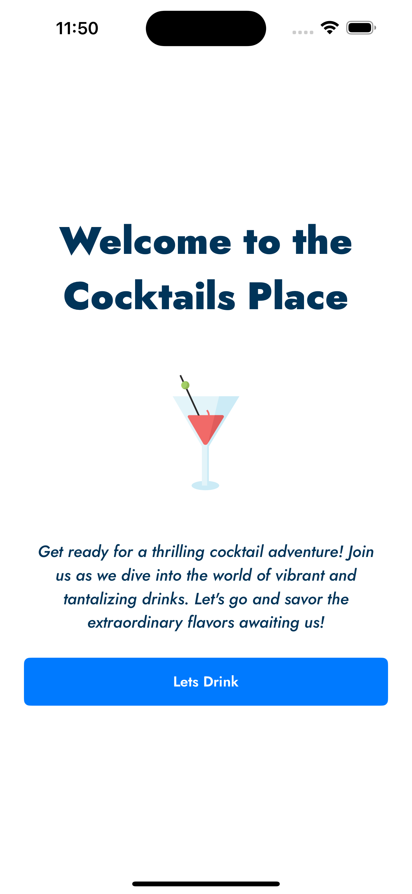
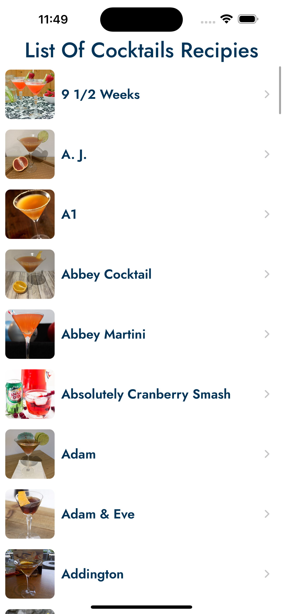
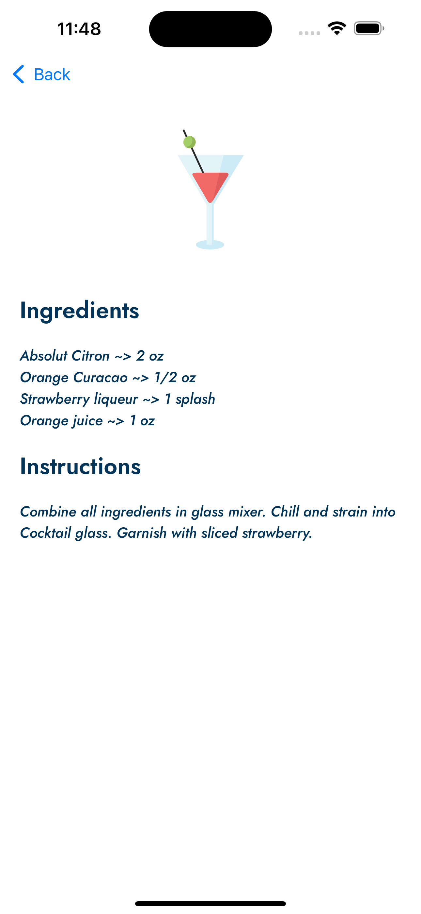

# The Cocktails App
---

In summary this is an app that loads a initial view and allows to browse throught a list of recipies of cocktail drinks for the user to prepare and enjoy.

Architecture
---
This app uses MVVM has a separation of concerns localy since its only one product it contains main pieces Views, Controllers, ViewModels, Models and Networking. I chosed to work with MVVM so i can show case how you can react to events changing inte view models in your view controllers using the power of combine. 

For the networking I used a shared ApiClient that handles most of the requests issues and only needs a Router and a decodable type for the return value of the requests made.

For The UI Layer i used UIkit and also a very cool framework called Anchorage that allows a easy and declarative way to build UI in code which helps with the undestanding of the big picture of layouts.

Skils Show cased
---

    - Refactoring Code (you can notice in the commit history the improvements from this version have a huge impact in amount of code and quality of the code).
    - Combine.
    - Alamofire.
    - Anchorage.
    - lottie (integrated animations from lottie).
    - SPM (removed CocoaPods and added all dependencies using SPM).

Screenshots
---

Videos
---
[App Usage Video](./mediaForReadme/AppUsage.mp4)
